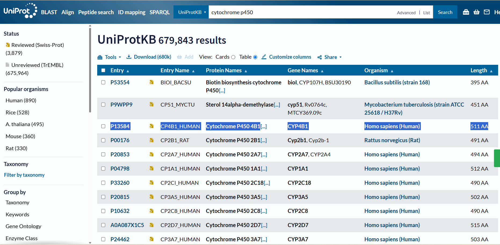
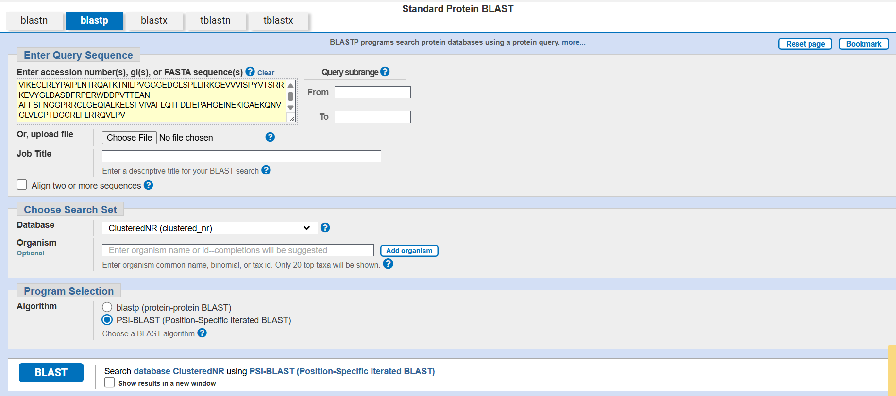

# Experiment 2: PSI-BLAST Analysis

## Aim

To use PSI-BLAST (Position-Specific Iterated BLAST) to identify homologous protein sequences and observe conserved regions through iterative sequence searching.

---

## Objectives

- To retrieve a protein sequence from UniProt.
- To perform PSI-BLAST analysis using the protein sequence.
- To identify homologous protein sequences.
- To compare the results obtained in different PSI-BLAST iterations.
- To observe sequence similarity, query coverage, and E-values.
- To understand how iterative searches improve the detection of related proteins.

---

## Introduction

PSI-BLAST (Position-Specific Iterated BLAST) is a sequence similarity search tool used to identify homologous proteins, including proteins that may have relatively low sequence similarity.

Unlike a single BLASTP search, PSI-BLAST performs multiple iterations. The significant sequences identified in one iteration are used to build a Position-Specific Scoring Matrix (PSSM), which is then used to search the database again.

This allows PSI-BLAST to detect more distantly related homologous proteins.

---

# Protein Used

The protein sequence used for this experiment was obtained from UniProt.

| Parameter | Observation |
|---|---|
| Protein | Cytochrome P450 4B1 |
| Gene | CYP4B1 |
| Organism | Homo sapiens |
| UniProt Accession | P13584 |
| Entry Name | CP4B1_HUMAN |
| Sequence Length | 511 amino acids |

The FASTA sequence corresponds to human Cytochrome P450 4B1.

---

# 1. UniProt Protein Search

The UniProt database was searched for **Cytochrome P450 4B1**.

The selected protein entry was:

**UniProt Accession:** P13584  
**Protein:** Cytochrome P450 4B1  
**Gene:** CYP4B1  
**Organism:** Homo sapiens  
**Length:** 511 amino acids

### Screenshot



---

# 2. UniProt FASTA Sequence

The FASTA sequence of human Cytochrome P450 4B1 was obtained from the UniProt entry.

The sequence header identified the protein as:

`sp|P13584|CP4B1_HUMAN Cytochrome P450 4B1`

The protein sequence contains **511 amino acids**.

### Screenshot


---

# 3. PSI-BLAST Input

The protein FASTA sequence was entered into the NCBI BLASTP/PSI-BLAST search interface.

The following settings were observed:

- **Program:** PSI-BLAST
- **Database:** ClusteredNR (clustered_nr)
- **Query:** Human Cytochrome P450 4B1 protein sequence
- **Query Length:** 511 amino acids

PSI-BLAST was selected instead of the standard BLASTP option to perform an iterative similarity search.

### Screenshot



---

# 4. PSI-BLAST Iteration 1

The first PSI-BLAST iteration produced significant matches to Cytochrome P450 4B1-related proteins.

The results showed very high sequence similarity among several homologous proteins.

### Representative Results

| Organism/Group | Protein | Query Cover | E-value | Percent Identity |
|---|---|---:|---:|---:|
| Primates | Cytochrome P450 4B1 isoform b [Homo sapiens] | 100% | 0.0 | 100.00% |
| Primates | Cytochrome P450 4B1 isoform c [Homo sapiens] | 100% | 0.0 | 96.88% |
| Rhesus monkey | Cytochrome P450 4B1 isoform X2 | 100% | 0.0 | 92.95% |
| Flying lemurs | Predicted Cytochrome P450 4B1 isoform | 100% | 0.0 | 87.70% |
| Moles and shrew-moles | Predicted Cytochrome P450 4B1 | 100% | 0.0 | 86.11% |
| Placentals | Cytochrome P450 4B1 | 100% | 0.0 | 86.30% |
| Rodents | Cytochrome P450 4B1 [Mus musculus] | 100% | 0.0 | 85.13% |

The first iteration showed strong similarity between the human CYP4B1 sequence and related Cytochrome P450 4B1 proteins from different organisms.

### Screenshot


---

# 5. PSI-BLAST Iteration 2

In the second iteration, the PSSM generated from the previous iteration was used to search for additional related sequences.

The results continued to show highly significant matches.

### Representative Results

| Organism/Group | Protein | Query Cover | E-value | Percent Identity |
|---|---|---:|---:|---:|
| Moles and shrew-moles | Predicted Cytochrome P450 4B1 | 100% | 0.0 | 86.11% |
| Flying lemurs | Predicted Cytochrome P450 4B1 isoform | 100% | 0.0 | 87.70% |
| Cape golden mole | Predicted Cytochrome P450 4B1-like | 100% | 0.0 | 85.32% |
| Southern two-toed sloth | Cytochrome P450 4B1 | 100% | 0.0 | 86.30% |
| Primates | Cytochrome P450 4B1 isoform b [Homo sapiens] | 100% | 0.0 | 100.00% |
| Rodents | Cytochrome P450 4B1 [Mus musculus] | 100% | 0.0 | 85.13% |
| Placentals | Cytochrome P450 4B1 | 100% | 0.0 | 86.30% |

The second iteration continued to identify closely related Cytochrome P450 4B1 proteins with complete or near-complete query coverage.

### Screenshot


---

# 6. PSI-BLAST Iteration 3

The third iteration was performed using the PSSM generated during the previous iteration.

The results again showed highly significant matches to Cytochrome P450 4B1-related sequences.

### Representative Results

| Organism/Group | Protein | Query Cover | E-value | Percent Identity |
|---|---|---:|---:|---:|
| Moles and shrew-moles | Predicted Cytochrome P450 4B1 | 100% | 0.0 | 86.11% |
| Flying lemurs | Predicted Cytochrome P450 4B1 isoform | 100% | 0.0 | 87.70% |
| Cape golden mole | Predicted Cytochrome P450 4B1-like | 100% | 0.0 | 85.32% |
| Southern two-toed sloth | Cytochrome P450 4B1 | 100% | 0.0 | 86.30% |
| Rodents | Cytochrome P450 4B1 [Mus musculus] | 100% | 0.0 | 85.13% |
| Greater mouse-tailed bat | Cytochrome P450 4B1 | 100% | 0.0 | 85.32% |
| Southern tamandua | Cytochrome P450 4B1 | 100% | 0.0 | 83.76% |
| Bats | Cytochrome P450 4B1-like | 100% | 0.0 | 84.38% |
| Japanese fox | Cytochrome P450 4F3 isoform X1 | 98% | 0.0 | 86.53% |

The third iteration continued to identify proteins with strong similarity to the query sequence.

### Screenshot


---

# Comparison of PSI-BLAST Iterations

| Parameter | Iteration 1 | Iteration 2 | Iteration 3 |
|---|---|---|---|
| Query | Human CYP4B1 | Human CYP4B1 | Human CYP4B1 |
| Query Length | 511 aa | 511 aa | 511 aa |
| Database | ClusteredNR | ClusteredNR | ClusteredNR |
| Query Coverage | Mostly 100% | Mostly 100% | Mostly 100% |
| E-value | 0.0 for representative hits | 0.0 for representative hits | 0.0 for representative hits |
| Sequence Identity | Up to 100% | Up to 100% | Up to 100% |
| PSSM | Initial profile generated | Updated profile used | Further updated profile used |

---

# Result

PSI-BLAST successfully identified homologous proteins related to human Cytochrome P450 4B1.

The query protein was:

**Cytochrome P450 4B1 (CYP4B1), Homo sapiens**  
**UniProt Accession:** P13584  
**Length:** 511 amino acids

The PSI-BLAST iterations produced highly significant matches with very low E-values and high sequence identities. Most representative hits showed **100% query coverage**, indicating strong similarity across the query sequence.

The results included Cytochrome P450 4B1-related proteins from primates, rodents, bats, moles, flying lemurs, and other mammals.

---

# Conclusion

PSI-BLAST was successfully used to identify homologous proteins related to human Cytochrome P450 4B1.

The iterative searches demonstrated that PSI-BLAST can identify and compare related protein sequences using a position-specific scoring matrix. The high sequence identities, complete query coverage, and highly significant E-values observed in the results indicate strong evolutionary relationships among many of the identified proteins.

---

# Key Learning

- UniProt can be used to retrieve protein sequences and annotations.
- PSI-BLAST performs iterative protein similarity searches.
- A PSSM is generated and updated during PSI-BLAST iterations.
- E-value indicates the statistical significance of a sequence match.
- Query coverage indicates how much of the query sequence is aligned.
- Percent identity indicates the proportion of identical amino acids in the alignment.
- Comparing multiple iterations helps in identifying and studying homologous proteins.

---

# Tools Used

- UniProt
- NCBI BLAST / PSI-BLAST
- ClusteredNR (clustered_nr)

---

# Repository Structure

```text
02-PSI-BLAST/
│
├── README.md
│
└── screenshots/
    ├── 01-UniProt-search.png
    ├── 02-UniProt-FASTA.png
    ├── 03-PSI-BLAST-input.png
    ├── 04-PSI-BLAST-iteration 1.png
    ├── 05-PSI-BLAST-iteration 2.png
    └── 06-PSI-BLAST-iteration 3.png
