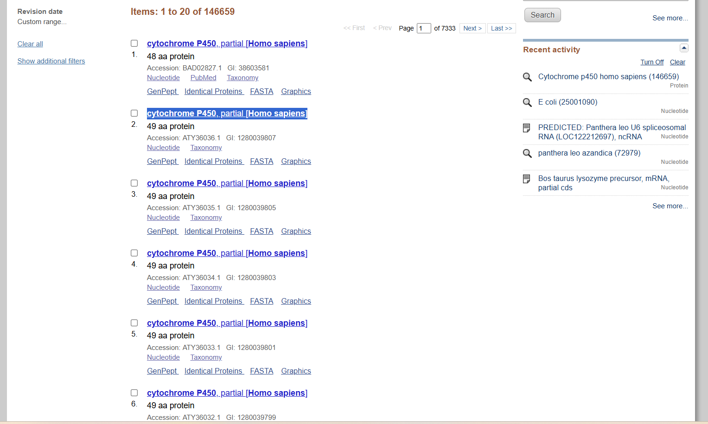
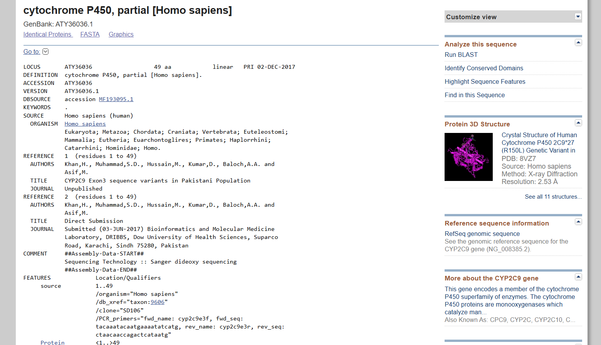
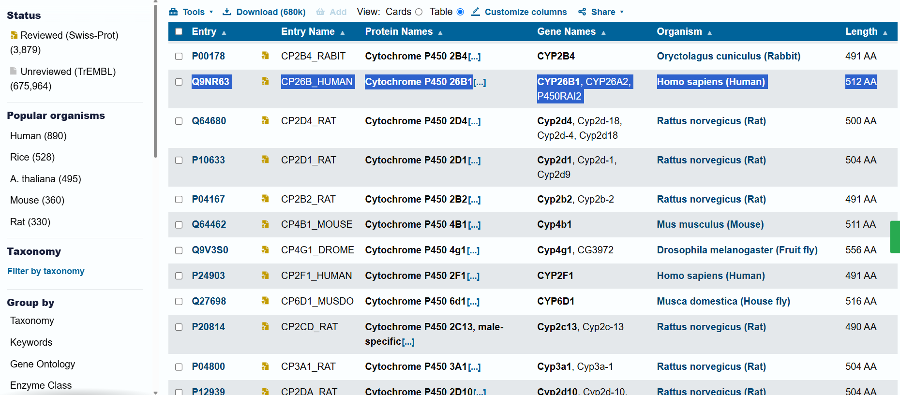
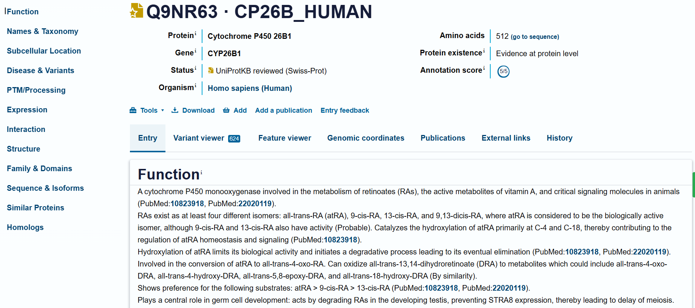
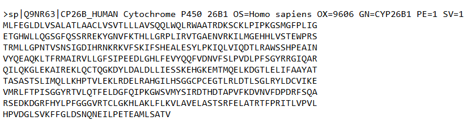
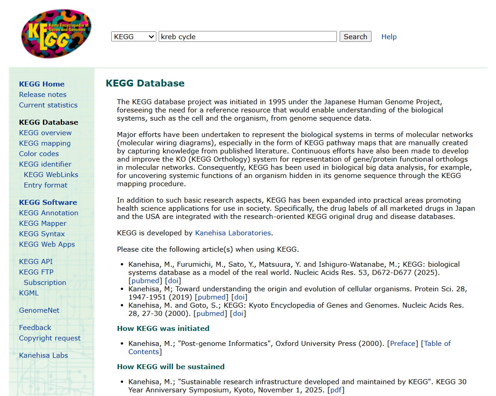
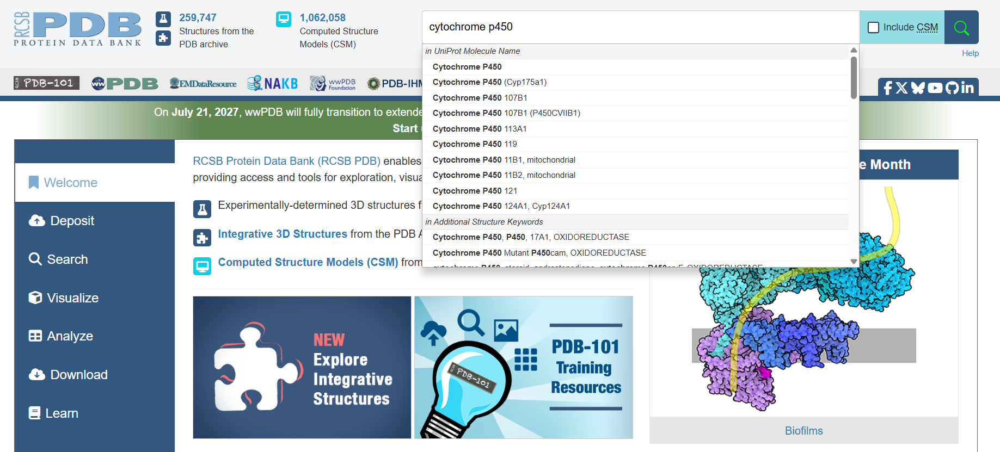
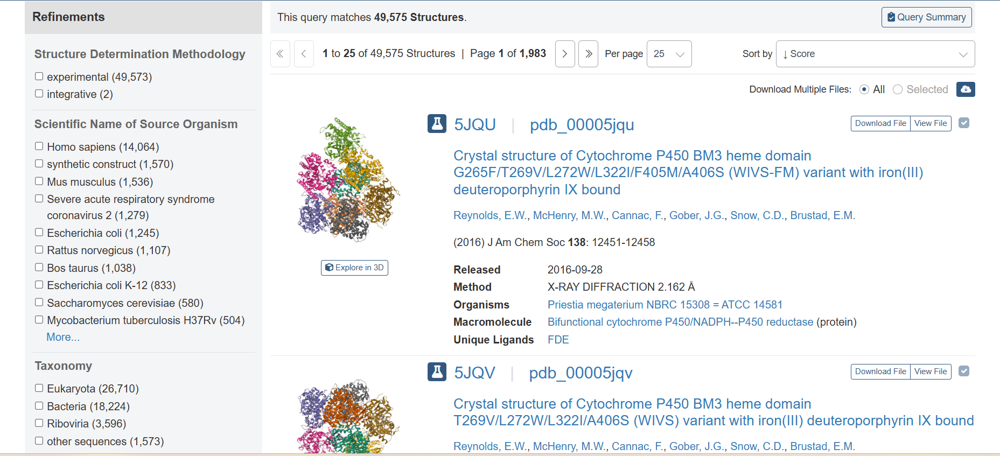
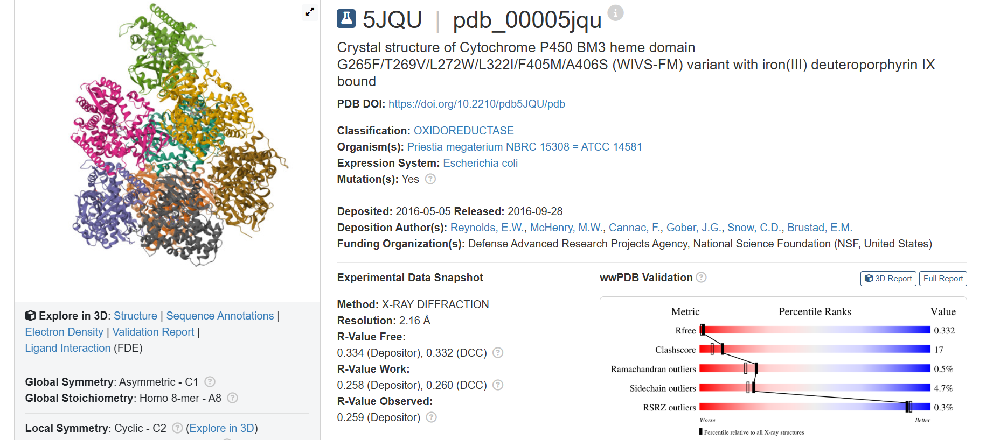

# Experiment 1: Database Observations

## Gene of Interest

- **Gene:** LYZ
- **Protein:** Lysozyme C
- **Organism:** Homo sapiens

---

## 1. NCBI GenBank

The NCBI Nucleotide database was searched for human lysozyme.

### Observed Information

- **Description:** Human lysozyme mRNA, complete cds
- **Accession:** M19045.1
- **Sequence length:** 1,483 bp
- **Organism:** Homo sapiens
- **Molecule:** mRNA

### Screenshots

#### NCBI Search

#### NCBI GenBank Record

#### NCBI FASTA Sequence

---

## 2. UniProt

UniProt was explored to obtain protein-level information for human lysozyme.

### Observed Information

- **UniProt ID:** P61626
- **Entry Name:** LYSC_HUMAN
- **Protein:** Lysozyme C
- **Gene:** LYZ
- **Organism:** Homo sapiens
- **Protein length:** 148 amino acids
- **Status:** UniProtKB reviewed (Swiss-Prot)
- **Protein existence:** Evidence at protein level

### Screenshots

#### UniProt Search

#### UniProt Record

#### UniProt FASTA Sequence

---

## 3. KEGG

The KEGG database was explored to study biological pathway information.

### Observed Information

- **Pathway ID:** map00010
- **Pathway:** Glycolysis / Gluconeogenesis
- **Class:** Metabolism; Carbohydrate metabolism

### Screenshots

#### KEGG Search

#### KEGG Pathway Record

#### KEGG Pathway Result

---

## 4. Protein Data Bank (PDB)

The Protein Data Bank was explored to examine available three-dimensional protein structures related to lysozyme.

### Observed Information

- **PDB ID:** 168L
- **Structure:** T4 lysozyme
- **Organism:** Tequatrovirus T4
- **Experimental method:** X-ray diffraction
- **Resolution:** 2.90 Å
- **Macromolecule:** T4 lysozyme

### Screenshots

#### PDB Search

#### PDB Structure Record

#### PDB 3D Structure

> **Note:** PDB entry 168L represents T4 lysozyme and is not the human LYZ protein structure. It is included as a lysozyme-related structural example observed during database exploration.

---

## Overall Observation

| Database | Information Retrieved |
|---|---|
| NCBI GenBank | Human LYZ mRNA sequence |
| UniProt | Human Lysozyme C protein information |
| KEGG | Glycolysis / Gluconeogenesis pathway |
| PDB | T4 lysozyme three-dimensional structure |

## Conclusion

Different biological databases were successfully explored to understand the types of biological information they provide. NCBI provided nucleotide sequence information, UniProt provided protein information, KEGG provided pathway information, and PDB provided three-dimensional structural information.
