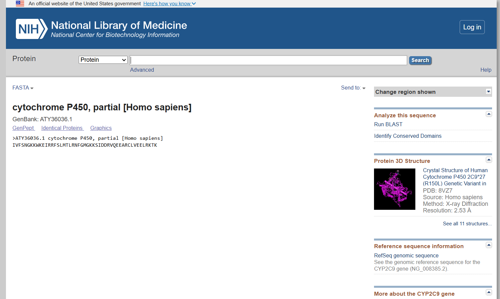
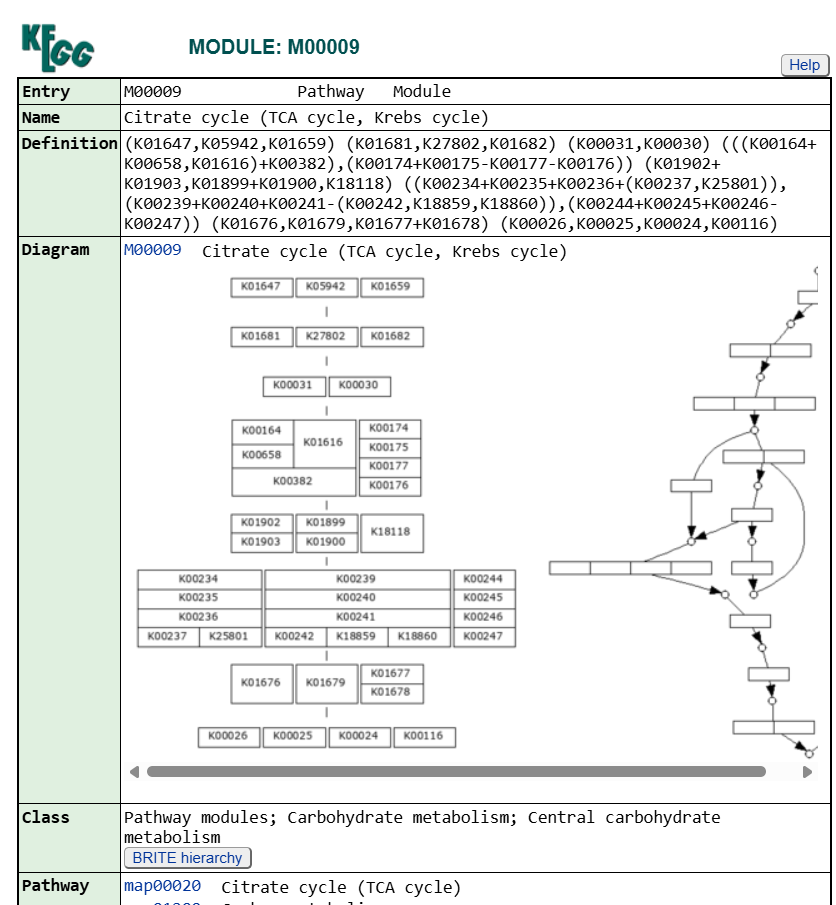

# Experiment 1: Database Observations

## Gene/Pathway of Interest

- **Target/Protein:** Cytochrome P450 (e.g., CYP26B1) / Krebs Cycle
- **Organism:** Homo sapiens

---

## 1. NCBI

The NCBI database was searched for human Cytochrome P450 sequences.

### Observed Information

- **Description:** cytochrome P450, partial [Homo sapiens]
- **Accession:** ATY36036.1
- **Sequence length:** 49 aa
- **Organism:** Homo sapiens
- **Molecule:** Protein

### Screenshots

#### NCBI Search

#### NCBI GenBank Record

#### NCBI FASTA Sequence

---

## 2. UniProt

UniProt was explored to obtain comprehensive protein-level information for human Cytochrome P450 variants.

### Observed Information

- **UniProt ID:** Q9NR63
- **Entry Name:** CP26B_HUMAN
- **Protein:** Cytochrome P450 26B1
- **Gene:** CYP26B1
- **Organism:** Homo sapiens (Human)
- **Protein length:** 512 amino acids
- **Status:** UniProtKB reviewed (Swiss-Prot)
- **Protein existence:** Evidence at protein level

### Screenshots

#### UniProt Search

#### UniProt Record

#### UniProt FASTA Sequence

---

## 3. KEGG

The KEGG database was explored to study biological pathway information related to central metabolism.

### Observed Information

- **Search Term:** kreb cycle
- **Module ID:** M00009
- **Pathway:** Citrate cycle (TCA cycle, Krebs cycle) (Pathway: map00020)
- **Class:** Pathway modules; Carbohydrate metabolism; Central carbohydrate metabolism

### Screenshots

#### KEGG Search

#### KEGG Pathway Record

.png)

#### KEGG Pathway Result

---

## 4. Protein Data Bank (PDB)

The Protein Data Bank was explored to examine available three-dimensional protein structures related to the target protein.

### Observed Information

- **Search Query:** cytochrome p450
- **Observation:** A general search was initiated to explore various experimentally-determined and computed structure models (CSM) for Cytochrome P450.

### Screenshots

#### PDB Search

---

## Overall Observation

| Database | Information Retrieved |
|---|---|
| NCBI | Human Cytochrome P450 partial protein sequence (49 aa) |
| UniProt | Human Cytochrome P450 26B1 (CYP26B1) reviewed protein information |
| KEGG | Citrate cycle (TCA cycle, Krebs cycle) pathway modules and diagrams |
| PDB | Structural search parameters for Cytochrome P450 3D models |

## Conclusion

Different biological databases were successfully explored to gather multifaceted data. NCBI provided specific protein sequence records (partial Cytochrome P450), UniProt provided comprehensive reviewed protein annotations (CYP26B1), KEGG detailed central metabolic pathways like the Krebs cycle, and PDB was utilized to search for corresponding three-dimensional structural models.
